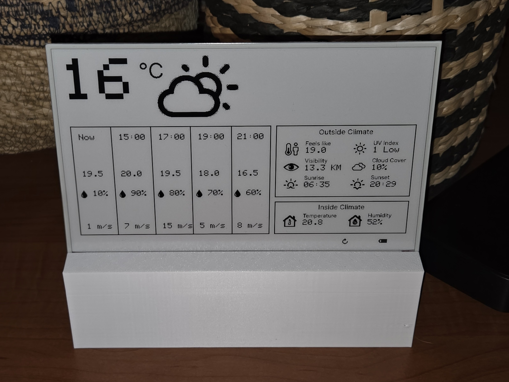
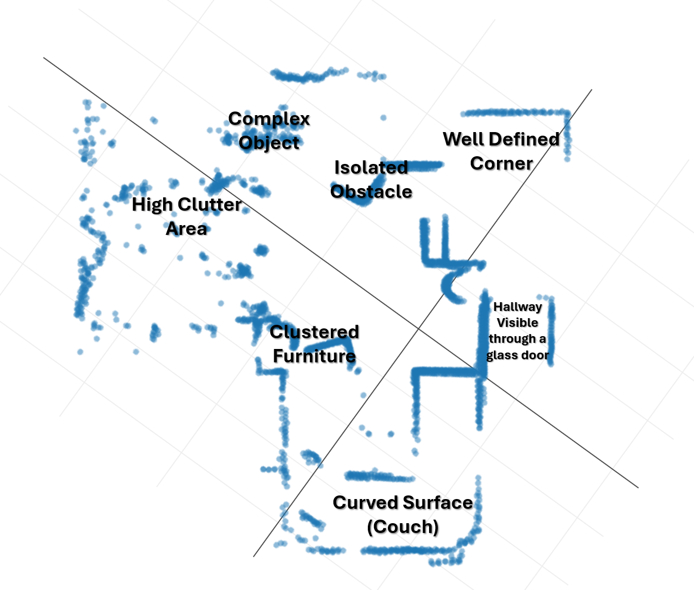
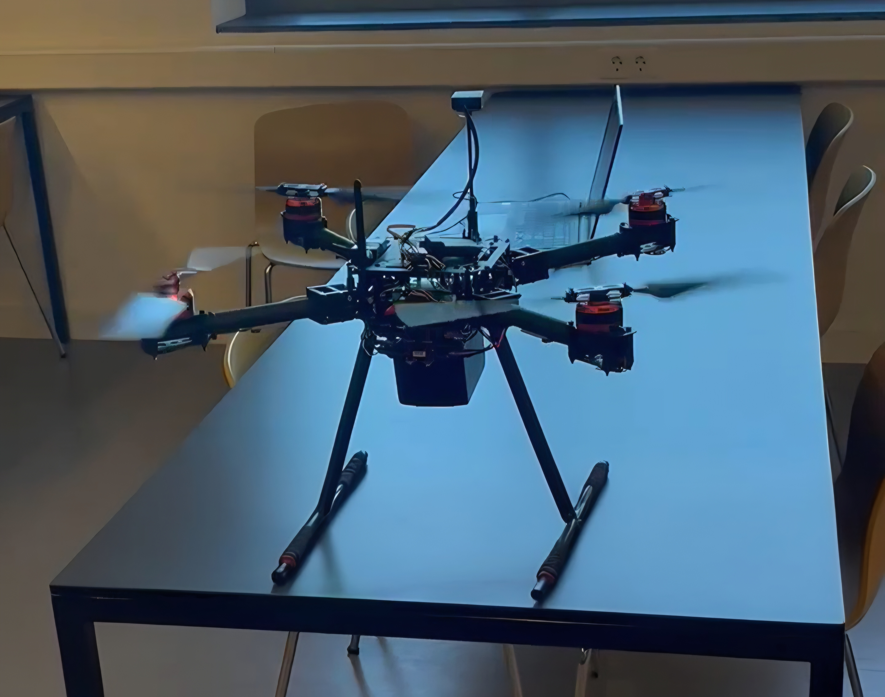

# Caspar Niekus - Project Portfolio

Hi, I'm Caspar, a curious and hands-on Embedded Computer Engineering student specializing in bridging the gap between hardware and software. I thrive on solving complex problems and building tangible products from concept to reality. This portfolio showcases some of my favorite projects.

## **1. StratusDash E-Paper Weather Station**

*A low-power, standalone wall-mounted weather display featuring a custom, intuitive UI designed for at-a-glance information.*

*An image of a prototype of the StratusDash device, showcasing its sleek design and user-friendly interface.*

### 1.1. The Story & The Challenge

I grew up with a weather station at home, but it was always a point of frustration. It burned through batteries, looked dated, and the outside unit barely worked. When a school project allowed me to build one in an individual project, I jumped at the chance to create something better. The core challenge was twofold: build a full-stack system from the ground up, and make the device so power-efficient it could run for months, feeling more like a piece of art than a gadget that needed constant attention.

Current prototype calculations show an 18-month battery life, admittedly overengineered due to an oversized battery selection, while the target design aims for 6 months between charges. This demonstrates the effectiveness of the power optimization strategies even with conservative hardware choices.

This project is ongoing, with the final integration of the backend and firmware being the next major milestone. StratusDash has already been validated with seven preorders from interested users, with a target delivery of the first units near Christmas.

### 1.2. Technical Insights & Key Achievements

My work on this project led to several key breakthroughs in both user experience and system design:

#### Key Breakthrough: Secure & Seamless Device Pairing

> My initial thought for device setup was a simple polling mechanism, but I quickly realized the security flaw: a third party could potentially hijack a device token during the pairing window. The solution was far more elegant: the device displays a unique QR code. Scanning this code takes the user to a secure webpage, authenticates them, and pairs the device to their account in a single, seamless action. This insight became a cornerstone of the user experience.

#### Key Design Decision: Designing a Scalable Database

> While designing the database, I initially stored the device's firmware version with every single sensor reading. I realized this was incredibly redundant. This led me to design a separate `DeviceStatusHistory` table. This normalized structure not only saves space but creates a robust, future-proof way to log any significant, infrequent device events (like updates or errors), making the entire schema more professional and scalable.

The project demonstrates a full-stack skill set:

- **Backend:** A feature-rich **Python/FastAPI** backend API deployed on a **Linux** server for data ingestion, database management, and secure user authentication using **JWTs**.
- **Firmware:** Highly optimized **C++** firmware for the ESP32, using deep-sleep cycles and minimal data payloads to maximize battery life.
- **Design:** A user-centered design process using **Figma** to create and test multiple UI prototypes, ensuring an intuitive final product.

### 1.3. Technologies Used

`C++` `Python` `FastAPI` `JavaScript` `Figma` `JWT` `REST APIs` `Database Design` `Linux` `Raspberry Pi` `ESP32`

> **Note:** The source code for this project is proprietary. I am happy to provide a detailed walkthrough of the architecture and code during an interview.

---

## 2. Autonomous 2D Mapping Robot – AURA

*A proof-of-concept for an autonomous warehouse surveillance robot, designed to navigate and map its environment as a foundational step towards full autonomy.*

*A hero shot of the AURA robot, taken on location in a professional warehouse to showcase the project's commercial application and product vision.*

### 2.1. The Story & The Challenge

The high-level vision for AURA was to create an autonomous robot for warehouse surveillance, capable of monitoring climate, detecting air quality changes with a TVOC sensor, and patrolling the premises. To communicate this vision, I storyboarded, scripted, and produced a promotional video, securing a professional warehouse as a filming location. To watch it, click the image above [or click here](https://www.youtube-nocookie.com/embed/T0WJigca8sU?si=kgRUZoF5qTz-dyqW).

However, before any of that could happen, the robot had to solve the most fundamental problem of autonomy: **how can a machine navigate a world it has never seen?** Our hardware, a Kobuki Rover, had drivers that were incompatible with standard ROS packages. This meant I had to tackle the challenge head-on by building a SLAM (Simultaneous Localization and Mapping) algorithm from first principles in C++, creating a functional GraphSLAM system that could process live LiDAR data on a resource-constrained Raspberry Pi.

### 2.2. Technical Insights & Key Achievements

The journey was filled with challenges, particularly with map warping and rotational errors. The key to the final, successful map was a combination of careful algorithm choice and a critical insight about initial guesses.

#### The Core Architecture: GraphSLAM from Scratch

> I implemented a GraphSLAM system using **GICP** (Generalized Iterative Closest Point) to match consecutive LiDAR scans. When the robot traveled more than 15cm, a new "keyframe" was added to a graph structure. When a loop closure was detected (recognizing a previously visited area), **Google's Ceres Solver** was used to optimize the entire graph, correcting accumulated drift and pulling the map into a coherent shape.

#### Key Breakthrough: The Power of a Good Initial Guess

> The ICP algorithm can easily get stuck in a "local minimum," producing a good-but-not-great alignment. I realized the key to preventing this was providing a strong initial guess. By using the robot's wheel **odometry** data to estimate its position between scans, I could feed this estimate to the GICP algorithm. This dramatically improved alignment accuracy and was the breakthrough that led to the first coherent map, demonstrating a practical application of sensor fusion.

This project was a deep dive into robotics, from high-level vision to low-level code:

- **Custom Algorithm:** Designed and implemented a GraphSLAM algorithm from scratch in **C++**.
- **Embedded Linux:** Deployed and tested the entire software stack on a Raspberry Pi running **Linux**.
- **Product Vision & Communication:** Storyboarded, scripted, and produced the promotional video to communicate the project's high-level goals.
- **Technical Documentation:** I documented the entire process extensively. **[You can read a deep dive into the `GraphSlamModule` here.](https://gist.github.com/CasparN/fe57a3669e1231af4732220ac598e01d)**

### 2.3. Analyzing the Result: Mapping a Complex Environment

The ultimate test of the algorithm was its performance in a real-world, cluttered environment. The image below is a raw point cloud generated by my custom C++ SLAM algorithm during a successful run in my living room.

As you can see from my annotations, the algorithm successfully navigated a series of common but difficult challenges for LiDAR-based SLAM:

- It correctly identified the hard geometry of a Well-Defined Corner, which served as a strong anchor for the map.
- It handled a High Clutter Area and Clustered Furniture without getting lost, demonstrating robustness against noisy data.
- It even captured data from a hallway visible through a glass door, a notoriously difficult scenario due to the transparency and reflectivity of the surface.

This result validates the core effectiveness of the GICP and GraphSLAM implementation in a challenging, non-ideal environment.

### 2.4. Technologies Used

`C++` `CMake` `SLAM` `LiDAR` `Ceres Solver` `PCL` `Linux (Ubuntu)` `Raspberry Pi`

> **Note:** The source code for this project is private in an academic setting. I am happy to provide a detailed walkthrough of the algorithm's architecture and implementation during an interview.

---

## 3. Autonomous Vineyard Drone – SAW Aero

*A custom-built autonomous drone developed to monitor vineyard health, irrigation, and provide bird deterrence.*

### 3.1. The Story & The Challenge

This ongoing project is a real-world exercise in adaptability and problem-solving. I took over a prototype from a previous team, which required significant reverse-engineering to understand their design choices and correct system flaws (like a risky dependency on the ground station for RC control). The main technical goal is to implement a low-cost, effective method for monitoring plant health using computer vision.

### 3.2. Technical Insights & Key Achievements

#### Key Breakthrough: Approximating NDVI with Standard Hardware

> Commercial NDVI cameras are expensive. My research showed I could approximate their results using a Raspberry Pi NoIR camera with a blue filter. The principle is to capture Near-Infrared (NIR) light in the camera's red channel and visible red light in the blue channel. By processing these images with a **Python** and **OpenCV** script using the formula `(Red - Blue) / (Red + Blue)`, I can generate a visual index of plant health. I have successfully built a prototype that can read from both the NoIR and a standard RGB camera, and I am currently refining the image processing pipeline with the goal of achieving a real-time NDVI approximation.

This project highlights my ability to:

- **Reverse Engineer:** Analyze and improve upon existing, undocumented systems.
- **Apply Research:** Translate academic principles (NDVI) into a practical, low-cost hardware and software solution.
- **Integrate Systems:** Work with flight controllers, communication protocols (**Mavlink**), and embedded systems (**Raspberry Pi**) to build a cohesive product.

### 3.3. Technologies Used

`Python` `OpenCV` `Mission Planner` `Mavlink` `Astro (Web Framework)` `Raspberry Pi`

> **Note:** As this is an active academic project, the source code is in a private repository. I am happy to provide a detailed walkthrough of the system architecture and image processing techniques during an interview.
