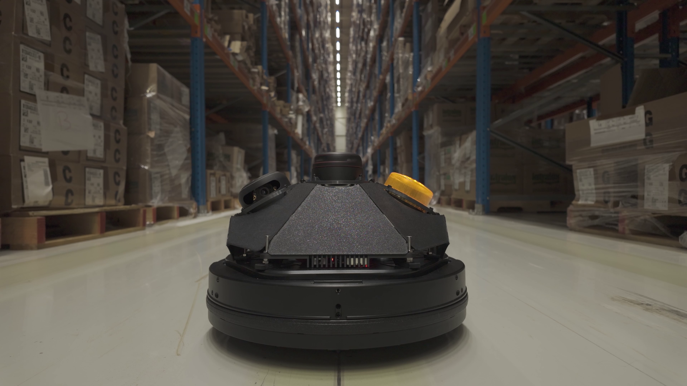

# Aura - Autonome LiDAR Robot - 09-2024 t/m 02-2025

Aura was een proof-of-concept voor een autonome beveiligingsrobot in een magazijnomgeving. Binnen dit project was mijn hoofdrol het bouwen van een eigen GraphSLAM-oplossing in C++, zodat de robot een onbekende omgeving kon mappen met LiDAR en odometrie.

**Mijn rol:** Lead C++ / SLAM Engineer

*Een hero shot van de AURA robot, gemaakt voor de promotievideo van het project.*

## Context

Het team wilde een autonome patrouillerende robot bouwen die kon navigeren in een magazijnomgeving en daarnaast klimaat- en luchtkwaliteitsdata kon verzamelen. De robot was gebaseerd op een Kobuki Rover met een LiDAR en draaide op een Raspberry Pi.

Voor de productvisie maakte ik ook het storyboard, schreef ik het script en produceerde ik de promotievideo, niet vereist voor school, maar omdat het leuk was. Maar de kern van mijn technische bijdrage zat in het autonomieprobleem: hoe weet een robot waar hij is in een omgeving die hij nog niet kent?

## Het probleem

De standaardroute voor dit soort robotica is vaak ROS met bestaande SLAM-packages. Onze Kobuki Rover had echter drivers die niet goed compatibel waren met de standaard ROS-oplossingen. Daardoor kon ik niet simpelweg een bestaande stack configureren.

Ik moest zelf een SLAM-pijplijn bouwen die LiDAR-scans en odometrie combineerde, live op een Raspberry Pi draaide en bruikbare kaarten kon genereren voor latere navigatie.

## Wat ik bouwde

Ik implementeerde een GraphSLAM-systeem in C++. De robot verzamelde LiDAR-scans, gebruikte wielodometrie als initiële bewegingsschatting en matchte opeenvolgende scans met GICP (Generalized Iterative Closest Point).

Wanneer de robot meer dan 15 cm had gereden, werd een nieuwe keyframe toegevoegd aan een graph. Bij een mogelijke loop closure werd Ceres Solver gebruikt om de graph te optimaliseren en opgebouwde drift terug te trekken naar een consistentere kaart.

De gegenereerde kaart werd later door een teamgenoot gebruikt als basis voor pathfinding, waardoor de robot autonoom naar een doel in een klaslokaal kon navigeren.

## Belangrijke technische inzichten

### SLAM was het project

Voor Aura is de SLAM-implementatie wel echt mijn toevoeging aan het project. Het was de technische kern van het project. Zonder kaartopbouw was er geen praktische autonomie, geen bruikbare pathfinding en geen geloofwaardige beveiligingsrobot. In [dit document](graphslammodule.md) is meer te lezen over hoe het precies in elkaar zat.

### De initiële schatting maakte het verschil

ICP-achtige algoritmes kunnen vastlopen in lokale minima. In mijn eerste pogingen ontstonden kaartvervormingen en rotatiefouten omdat de scanmatching te weinig context had.

De doorbraak was het gebruiken van odometrie als initiële schatting voor GICP. Door de wieldata mee te geven aan de scanmatcher begon het algoritme dichter bij de juiste oplossing. Dat verbeterde de uitlijning genoeg om de eerste duidelijke kaart te genereren.

### Realtime draaien op embedded Linux

De SLAM-stack moest niet alleen theoretisch werken, maar live draaien op een Raspberry Pi. Daarom gebruikte ik downsampling, keyframes en graph-optimalisatie om de hoeveelheid data beheersbaar te houden.

## Resultaat

De robot kon een ruwe maar bruikbare pointcloudkaart maken van een realistische, rommelige omgeving. De kaart herkende duidelijke hoeken, meubelpoten en zelfs een gang zichtbaar door een glazen deur.

Dit was geen perfect SLAM-systeem. Vooral rotaties en driftcorrectie bleven lastig. Maar het systeem bewees wel dat mijn C++-implementatie LiDAR en odometrie kon combineren tot een kaart die bruikbaar was voor verdere navigatie.

## Wat ik leerde

Aura leerde mij hoe snel robotica complex wordt wanneer algoritmes, sensoren, timing en hardwaredrivers samenkomen. Ik leerde ook dat een "from scratch" oplossing veel meer vraagt dan alleen code schrijven: je moet begrijpen waarom een algoritme faalt, welke sensorinformatie je mist en welke aannames je systeem nodig heeft om stabiel te worden.

Daarnaast leerde ik hoe waardevol communicatie is in technische projecten. De promotievideo hielp om de productvisie begrijpelijk te maken, terwijl de technische documentatie liet zien hoe de SLAM-oplossing werkte.

## Technische proof

- [GraphSLAM Module Deep Dive](graphslammodule.md) - technische uitleg van de implementatie, code, GICP, keyframes en beperkingen.
- [Promotievideo](https://youtu.be/T0WJigca8sU) - productvisie en demonstratie van het concept.

## Gebruikte technologieën

`C++` `CMake` `SLAM` `LiDAR` `GICP` `Ceres Solver` `PCL` `Eigen` `Linux` `Raspberry Pi`
