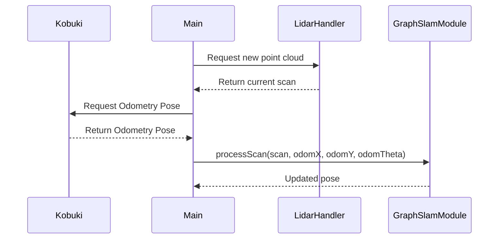
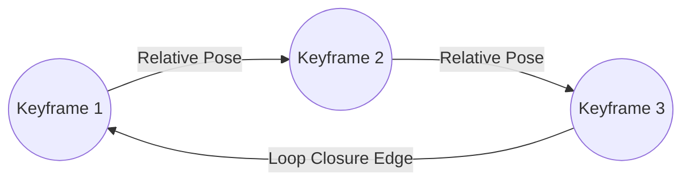
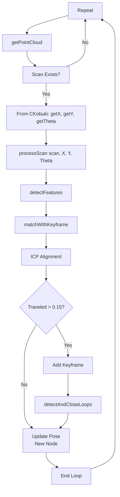
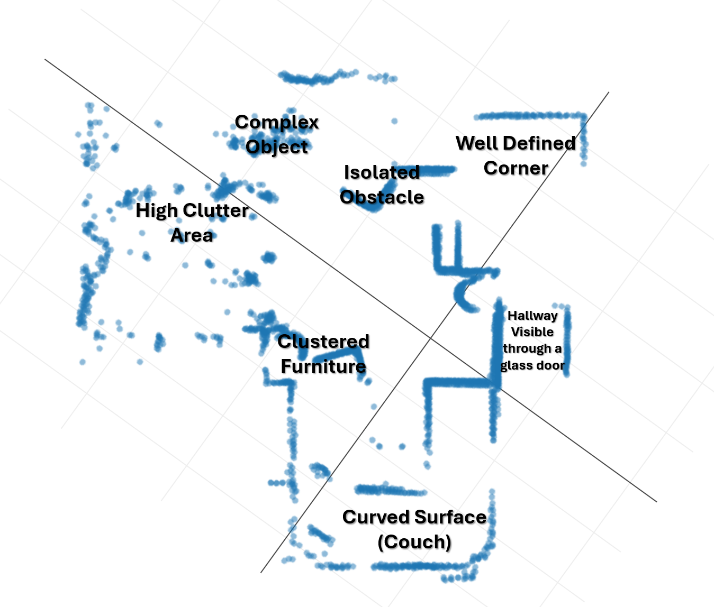

# AURA mapping the Unknown: A deep dive into our implementation

!!! note "Project Documentatie"
    Deze pagina is documentatie van het koppelingsproces. Het was geschreven in het Engels voor onze opdrachtgever.
    Dit document, uit 2024, is in originele staat hier te lezen om mijn documentatieproces te tonen.

Imagine you are a robot exploring an unknown maze. How do you build a map while navigating around? How do you use your many sensors to create an accurate interpretation of your environment? In this document, I explain how the `GraphSlamModule` for AURA attempts to solve this. It does this by combining two data sources: a LiDAR to look around, and by keeping track of how much the wheels have rotated, which is called odometry. This concept is called SLAM, which is Simultaneous Localisation and Mapping.

## 1. Why Combine Odometry and LiDAR?

That sounds like an interesting combination. Why would you combine odometry and LiDAR? Odometry is always available, and the LiDAR looks around and takes some time doing so. If you combine them both, you can figure out how much the robot has moved in between scans. Odometry can provide a good guess, which will be handy. Continue reading if you want to find out how!

### 1.1 Processing the Odometry Data

The odometry data is processed in the `CKobuki` driver, which is the base of our robot. When loading an instance of the driver and starting communication with the Kobuki, the `KobukiProcess` starts the `measure` thread. This thread runs the `loop` function, where the processing happens.

This `loop` function tracks the robot's position by measuring wheel rotations (like counting steps) and converts these into X/Y coordinates and orientation. It begins by recording the initial encoder values and gyro angle during the first iteration. For each update after that, it calculates the change in encoder counts for both left and right wheels. These encoder differences are then converted into linear distances travelled by each wheel. Using differential drive kinematics, the function updates the robot's `x` and `y` positions based on the average movement and adjusts the orientation `theta` according to the difference in wheel movements.

But even odometry is not perfect, it never is. Imagine counting your steps in a dark room: you make an educated guess of where you end up, but you don’t know with pinpoint accuracy, and errors accumulate over time. That’s one area where improvements are possible, which we’ll address later.

## 2. How Do We Map?

Walking in a dark room seems risky, how about you turn on the lights? Our robot has a LiDAR sensor, which creates a 2D scan of the environment. A quick look at the surroundings helps correct the drift from odometry. The LiDAR is being controlled by the LidarHandler class. The LiDAR is controlled by the `LidarHandler` class, which connects with the LiDAR driver, makes it rotate, and starts scanning. Then you can ask for a scan using `getPointCloud()`, which returns a scan of one rotation, converting data from polar coordinates to Cartesian coordinates. We’re mapping from the robot's perspective, so the starting position is (0,0), in meters.



## 3. Inside the GraphSlamModule

You can think of the `GraphSlamModule` as a cartographer, constantly updating the map when new data arrives. Once it gets new data, it creates a smaller version for later use, checks whether it lines up with the previous scan, and returns the transformation (`processScan`, `matchWithKeyframe`).

### 3.1 Common Mapping Challenges

Now that you know the gist of what the `GraphSlamModule` is, let's talk about the challenges of mapping. I already touched upon the first issue, which is odometry accumulating errors over time. This leads to drift, which means the estimated position will gradually diverge from its actual position. That isn't the only issue though, in bland spaces, the module can have problems detecting enough detail when comparing the maps and may misalign. The LiDAR scans can be distorted by reflective surfaces or obstacles. Scans can be slightly misaligned in the alignment process, and that also ends up with drift. And also, running the module in real-time means you need to process a lot of data, fast. Efficient algorithms and optimisations are necessary to ensure that the system can update the map and the robot’s position without significant delays.

### 3.2 Loop Closures

A moment ago I said that it remembers small versions of older scans. If the module detects that the robot has returned to a previously visited area (loop closure), it creates a constraint (“edge”) between the matching scans. These edges essentially pull the map into shape during graph optimization. Here’s a simplified diagram:



### 3.3 Graph Optimisation

Once you have a bunch of "edges" set up between different scans, they are getting pushed and pulled into shape. This shape is theoretically a coherent map. This process helps reduce drift, say the robot went around a circular hallway and had misaligned a few scans only slightly. Those errors accumulate over time, which is why once a loop closure is made we optimise the entire map and try to pull everything back into shape.

The actual tugging and pulling is done by Ceres. Ceres is an open-source C++ library focusing on these optimisation problems, and it's highly optimised. Once the constraints are satisfied, the map is updated in a way that minimises global drift.

## 4. The Role of ICP

But what happens at the start? How does the "cartographer" even compare two point clouds? It does this by performing Iterative Closest Point, ICP for short. This algorithm iteratively minimises the gap between the two point clouds and finds the optimal transformation and rotation that aligns them.

However, ICP has a crucial challenge: it can get stuck in what's called a local optimum. Imagine trying to perfectly fit two puzzle pieces together automatically. ICP is like trying to slide one piece around on top of the other until they match. Sometimes, you might find a spot where they seem to fit *pretty well*. The edges are close, and it looks almost right. ICP can get "stuck" in this "pretty well" spot, thinking it's found the best fit because any *small* move actually makes the fit worse.

The problem is that even though there might be a *much better* way for the pieces to fit together, the "pretty well" spot is like a little dip or valley. To get to the *true* perfect fit, you'd have to make a bigger, more significant movement that initially makes the fit worse before it gets better. ICP, in its basic form, is like a blindfolded person taking small steps downhill. It can easily find the bottom of a small valley, but it can't see or jump over the ridge to get to a deeper valley (the truly optimal alignment). This problem is harder to solve in 3D, so I'm glad our LiDAR is 2D.

This is why a good initial guess is so important for ICP. If you place your puzzle piece in the approximate area of where you might've ended up, ICP can fine-tune that into the right spot. By already being close to the actual right fit, you've got less risk of accidentally ending up in a spot that is "pretty good". This is why the `GraphSlamModule` uses odometry as its starting point. Without this good initial guess, ICP might get stuck aligning the current scan to the previous one in a suboptimal way, leading to inaccuracies in our map.

## 5. Putting It All Together in Code

This entire process runs in one thread from `main`: the `lidarAndSlamThread`. It enables asynchronous operation so the program can run independently of other processes. Let's look at the code together:

```cpp
void lidarAndSlamThread(GraphSlamModule& slam, LidarHandler& lidar, CKobuki& kobuki, websocket_endpoint& endpoint, int id, std::atomic<bool>& run) {
    int scanCount = 0;
    while (run) {
        auto scan = lidar.getPointCloud();
        if (scan && scan->size() > 1) {
            {
                std::lock_guard<std::mutex> lock(slamMutex);
                currentScan = scan;
            }
            long double OdomX = kobuki.getX();
            long double OdomY = kobuki.getY();
            long double OdomTheta = kobuki.getTheta();
            slam.processScan(currentScan, OdomX, OdomY, OdomTheta);
            
            double x = slam.getCurrentPose().translation().x();
            double y = slam.getCurrentPose().translation().y();
            double theta = std::atan2(slam.getCurrentPose().linear()(1,0),
                                      slam.getCurrentPose().linear()(0,0));
            scanCount++;
        }

        std::this_thread::sleep_for(std::chrono::milliseconds(10));
        if (scanCount == 15) {
            scanCount = 0;
            std::cout << "Sending data to server" << std::endl;
            sendMapAndPose(endpoint, id, std::ref(slam));
        }
    }
}
```

As you can see, this one function does the entire SLAM process. The function takes in the following classes: The `GraphSlamModule`, the `LidarHandler`, the `CKobuki` and the `websocket_endpoint`. It also gets the `run` variable passed in. Since it is a looping thread, we need to be able to stop it from the outside, and that is the role of this variable. We need the WebSocket class to be able to send this cloud to the server. We do that every 15 scans, which is why we need to initialise `scanCount`. It keeps track of how many scans have been processed so far. Then, we request a point cloud from the LiDAR. If that is successful, the scan is written to the global variable `currentScan`. `slamMutex` makes sure that happens safely, because we may want to be able to access the `currentScan` elsewhere in the code later on.

Now we have the raw point cloud from the LiDAR, but that isn't all that the `GraphSlamModule` requires. We need to request the odometry pose estimation from the `CKobuki` class. This is done by using `kobuki.GetX();` and those other functions. These are accessors, and safely get the data from the `CKobuki` class. This is then provided to the main method that kicks everything off, the `slam.processScan();` function. We pass the `x`, `y` and `theta` into the method and it gets to work.

### 5.1 The `ProcessScan` method

```cpp
Eigen::Isometry2d GraphSlamModule::processScan(const pcl::PointCloud<pcl::PointXYZ>::Ptr& scan, long double odomX, long double odomY, long double odomTheta)
{
    auto features = detectFeatures(scan);

    // No previous node
    if (nodes_.empty()) {
        SlamNode firstNode;
        firstNode.id = nodeCount_++;
        firstNode.pose.setIdentity();
        firstNode.keyScan = features;
        nodes_.push_back(firstNode);
        lastPose_ = firstNode.pose;
        return lastPose_;
    }
// ... code continues, we'll get to that later
```

`GraphSlamModule` takes an incoming point cloud from the LiDAR and downsamples it by applying a `VoxelGrid` filter in the `detectFeatures` function. This effectively discards most of the raw sensor data, keeping only a subset of points that represent key features. By using downsampled point clouds, the SLAM system can reduce the computational load required for alignment and loop-closure detection. Iterative algorithms like ICP or GICP operate faster on fewer points, which matters greatly for real-time performance. This is true in our case because the robot is moving and must process scans fast. Additionally, downsampling can filter out noisy or redundant information, focusing the alignment on important features rather than overwhelming ICP with excessive data.

There are negatives to that approach though, as you are throwing away data, which means you lose some fidelity. It may also impact matching with other nodes in feature-rich areas, where you really do lose some precision. Nevertheless, for our application, the performance gains outweigh the loss of detail, and downsampling stands as a practical compromise between resolution and efficient computation. This is running on a Pi 5 after all.

```cpp
 // processScan function, more code above
    // Match with last node
    auto& lastNode = nodes_.back();
    Eigen::Isometry2d relPose = matchWithKeyframe(features, lastNode.keyScan, odomX, odomY, odomTheta);
    lastPose_ = lastNode.pose * relPose;
    // more code below too
```

Then, after the downsampling, we check if there has been a previous scan, and if not, we set the scan as the first node. If there has been an earlier scan, we match it with the previous node.

### 5.2 The `matchWithKeyframe` method

We do this using the `matchWithKeyframe` function. This function does the comparing and returns the translation. Let's take a look at it.

```cpp
Eigen::Isometry2d GraphSlamModule::matchWithKeyframe(
    const pcl::PointCloud<pcl::PointXYZ>::Ptr& features,
    const pcl::PointCloud<pcl::PointXYZ>::Ptr& keyFeatures, 
    long double odomX, long double odomY, long double odomTheta)
{
    pcl::GeneralizedIterativeClosestPoint<pcl::PointXYZ, pcl::PointXYZ> icp;
    icp.setMaximumIterations(180); // The amount of iterations GICP will perform
    icp.setMaxCorrespondenceDistance(1); // The max distance between scans
    icp.setTransformationEpsilon(1e-9); // Defines minimum change between scans
    icp.setEuclideanFitnessEpsilon(0.03); // Convergence criteria
    icp.setRANSACIterations(80); // Ransac Iterations for outlier rejection
    icp.setRANSACOutlierRejectionThreshold(0.02); // Defines outlier threshold
    icp.setInputSource(features);
    icp.setInputTarget(keyFeatures);

    pcl::PointCloud<pcl::PointXYZ> aligned;

    // Check if odometry is valid using isfinite()
    bool hasValidOdom = std::isfinite(odomX) && 
                       std::isfinite(odomY) && 
                       std::isfinite(odomTheta);

    if (hasValidOdom) {
        // Create a transformation matrix from odometry
        Eigen::Matrix4f initialGuess = Eigen::Matrix4f::Identity();
        
        // Handle rotation
        float c = std::cos(odomTheta);
        float s = std::sin(odomTheta);
        initialGuess.block<2,2>(0,0) << c, -s,
                                       s,  c;
        // Translation
        initialGuess.block<2,1>(0,3) << odomX, odomY;
        icp.align(aligned, initialGuess);
        
    } else {
        icp.align(aligned);
    }

    Eigen::Isometry2d transform = Eigen::Isometry2d::Identity();
    if (icp.hasConverged()) {
        Eigen::Matrix4f m = icp.getFinalTransformation();
        std::cout << "ICP converged with score: " << icp.getFitnessScore() << std::endl;

        transform.linear() << m(0,0), m(0,1),
                             m(1,0), m(1,1);
        transform.translation() << m(0,3), m(1,3);
    } else {
        std::cerr << "ICP failed to converge. Score: " << icp.getFitnessScore() 
                  << " Max iterations: " << icp.getMaximumIterations() << std::endl;
    }
    
    return transform;
}
```

It does this by using GICP, which is a related version of ICP. We can see that the `matchKeyFrame` function gets the scan and the odometry pose passed into it.

#### 5.2.1 Variables of GICP

First, we set the parameters, a short explanation of which is provided in the code snippet. Tuning these variables adjusts the way this algorithm performs, and they're quite interesting.

- **`setMaximumIterations(180)`**  
  Maximum number of iterations for convergence. More iterations can yield better alignment but increases computation time.

- **`setMaxCorrespondenceDistance(1)`**  
  The maximum distance for considering two points as potential matches. Setting it too large can cause incorrect pairings.

- **`setTransformationEpsilon(1e-9)`**  
  Convergence criterion for minimal change between iterations.

- **`setEuclideanFitnessEpsilon(0.03)`**  
  Threshold for convergence based on the mean squared error of correspondences.

- **`setRANSACIterations(80)`**  
  Number of RANSAC iterations for outlier rejection.

- **`setRANSACOutlierRejectionThreshold(0.02)`**  
  Defines how far a point can be from a model before it’s considered an outlier.

#### 5.2.2 Performing the matching

It then checks whether or not the odometry is valid. This is because this method is also used in another part of the `GraphSlamModule`, and then there is no odometry available. Anyways, we convert those three numbers into a transformation matrix, which is the data type that (G)ICP accepts, and then align using the initial guess. If there is no valid odometry, we just align.

If the alignment was successful, we edit the newly created `transform` variable and apply the transformations to it. This `transform` variable is of the type `Eigen::Isometry2d`, which is from the Eigen library, a popular library for linear algebra. It is used in the `GraphSlamClass`, because we use a lot of math. We then return that `transform` variable. If the alignment fails, we provide some debug information to the console and return the unchanged transformation. I've barely seen ICP fail to converge, so this is fine.

### 5.3 Keyframe and Loop Closure Handling

Once the transformation gets returned to `processScan` we update the `lastNode.pose` with the transform to move it to the right place and update the robot's latest position. Then we check if that position is more than 15 centimetres from the last keyframe. If that is the case, a new keyframe is added. This creates a new `SlamNode`, assigns an ID, saves the pose, saves the point cloud, and pushes the node back. It also adds an edge, which is a constraint between scans.

```cpp
 // code above from ProcessScan
     double traveled = (lastPose_.translation() - lastNode.pose.translation()).norm();
     if (traveled > 0.15) { // Add keyframe every 15cm
      // Add new keyframe and edge
      SlamNode newNode;
   newNode.id = nodeCount_++;
   newNode.pose = lastPose_;
   newNode.keyScan = features;
   nodes_.push_back(newNode);
   
   SlamEdge edge;
   edge.from = lastNode.id;
   edge.to = newNode.id;
   edge.relativePose = relPose;
   edges_.push_back(edge);
   
   detectAndCloseLoops(newNode.id);
 }
 return transform;
}
```

Then, we detect if the new keyframe maps on any of the other keyframes by using `detectAndCloseLoops`. It's like checking if we've been there before. If we do, we optimise the graph by adjusting the poses of the nodes to satisfy the constraints imposed by the edges. Which, essentially, is tugging and pulling. We then have a finalised map, ready to get used by the path-finding algorithm.

Here's a flowchart of the entire implementation:



## 6. Does it work?

Yes. Most of the time. Here's a picture of a map it created by driving two meters forward in my living room. It drove from the origin to the left, following the black line.



This looks pretty cool and it's pretty accurate. This shows that this way of processing LiDAR data works well when driving straight forward. The algorithm doesn't handle in-place rotations very well, but that is something to iron out later.

Other known limitations are:

- Odometry drift is not being corrected.
    - **Potential Solution**:
   Correct the drift, or only take the delta from the previous scan.
- Basic feature detection
    - **Solution**:
   Look into implementing a more advanced version of feature detection.
- Optimise GICP variables, they're surely not optimal yet. We've played around with them, but knowing what the best ones are is hard.
    - **Solution**:
   Test them out.

Tackling these issues would greatly improve mapping accuracy, but I didn't have time to implement them.

## 7. Conclusion

In conclusion, the `GraphSlamModule` represents a significant step towards enabling autonomous navigation for our AURA robot. By combining odometry and LiDAR point clouds through ICP-based scan matching, we get a good idea of its environment. We discussed how the code works, made sense of key algorithms and identified limitations such as odometry drift or suboptimal parameter choices. This is how you perform SLAM, a simple version, but a good starting point for future enhancements!

## References

- [Ceres Solver](http://ceres-solver.org/)
- [PCL](https://pointclouds.org/)
- [Eigen](http://eigen.tuxfamily.org/index.php?title=Main_Page)
- [GICP](https://pcl.readthedocs.io/projects/tutorials/en/latest/generalized_icp.html)
- [Differential Drive Kinematics](https://en.wikipedia.org/wiki/Differential_wheeled_robot)
