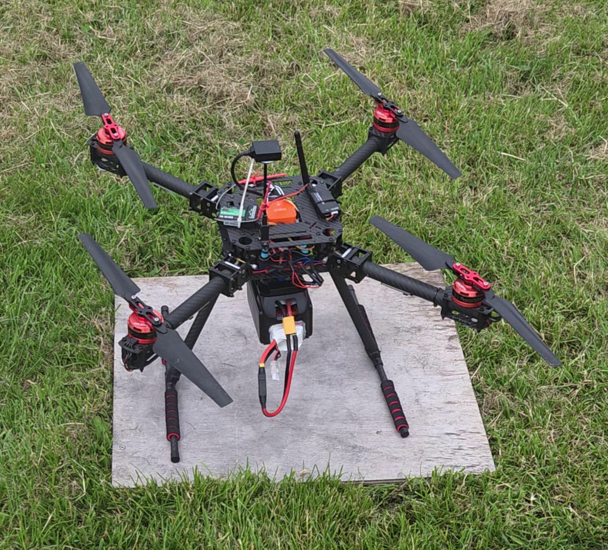

# Autonomous Vineyard Drone - SAW Aero - 03-2025 t/m 06-2025

Dit project draaide om het doorontwikkelen van een overgenomen droneprototype voor autonome wijngaardmonitoring. Mijn bijdrage zat vooral in systeemintegratie, Mission Planner-configuratie, vliegtesten, hardware-aanpassingen en een low-cost NDVI-cameraprototype.

**Mijn rol:** Drone Pilot, Mission Planner Configurator & NDVI Sensor Engineer

## Context

Het team ontving een prototype van een vorige projectgroep. Er was weinig documentatie en meerdere praktische onderdelen waren nog niet goed uitgewerkt. Het doel was om de drone autonoom een route te laten vliegen en beelddata te verzamelen die later gebruikt kon worden voor irrigatie- of plantgezondheidsanalyse.

Dit was minder een "veel code schrijven"-project en meer een systeemproject: uitzoeken wat er al was, configureren wat niet klopte, hardware veilig maken en genoeg grip krijgen op het platform om betrouwbare vluchten uit te voeren.

## Het probleem

De drone moest van overgenomen prototype naar bruikbare demonstrator. Dat betekende:

- begrijpen hoe de bestaande hardware en software in elkaar zat;
- een RC controller correct aansluiten en configureren;
- Mission Planner-missies opzetten;
- vliegtesten uitvoeren;
- hardwareproblemen herkennen, zoals een motor die de verkeerde kant op draaide;
- een cameramodule bouwen en monteren zonder de drone onbruikbaar te maken.

## Wat ik deed

Ik configureerde de drone in Mission Planner, zette autonome missies op en voerde vliegtesten uit als pilot. Ook heb ik een controller aangesloten op de drone, omdat het vorige team dacht dat dit niet nodig was. Het was wel nodig voor de veiligheid en voor prototyping. Tijdens het testen identificeerde ik onder andere een motor die de verkeerde kant op draaide. Dat lijken kleine configuratiefouten, maar ze bepalen uiteindelijk of een drone veilig kan vliegen.

Voor het NDVI-gedeelte werkte ik met een Raspberry Pi NoIR-camera en een standaard RGB-camera. Ik maakte een low-cost camerasysteem waarmee live RGB- en NDVI-achtige beelden konden worden getoond. Ook ontwierp en 3D-printte ik een behuizing om de twee camera's op de drone te monteren.

## NDVI-prototype

Commerciële NDVI-camera's zijn duur. Mijn onderzoek liet zien dat een benadering mogelijk was met een Raspberry Pi NoIR-camera en een blauwfilter. Het idee is om nabij-infrarood licht en zichtbaar licht zo te verwerken dat een indicatie van plantgezondheid ontstaat.

Met Python en OpenCV verwerkte ik de camerabeelden tot een live visualisatie. Dit was vooral bedoeld als demonstratie en technische basis. Door tijdsdruk is het systeem niet gevalideerd op echte wijnstokken en is er geen volledige analyse uitgevoerd.

## Resultaat

Het resultaat was een drone die autonoom missies kon vliegen, en beschikte over een werkend prototype voor live RGB- en NDVI-visualisatie. Daarnaast leverde het project veel praktische systeemkennis op: configureren, testen, vliegen, hardware aanpassen en omgaan met onvolledige documentatie.

## Wat ik leerde

Ik leerde vooral hoe complex drones als systeem zijn. Een kleine configuratiefout of een verkeerd gemonteerde motor kan het hele systeem onbetrouwbaar maken. Veilig testen is daarom essentieel, net als het goed configureren van fallbacks. Wat moet de drone bijvoorbeeld doen wanneer het radiosignaal wegvalt?

Ook heb ik geleerd dat bij het overnemen van een bestaand systeem moeten eerdere keuzes en aannames opnieuw worden gevalideerd, zeker wanneer de documentatie onvolledig is. Zo bleek de aanname dat een RC-controller niet nodig was in de praktijk onjuist.

Daarnaast leerde ik hoe je een onderzoeksconcept als NDVI kunt vertalen naar een betaalbaar prototype. Binnen de looptijd van tien weken was er helaas niet genoeg tijd om dit onderdeel volledig uit te werken.

## Demonstratie

Hierbij een video van de drone die rondvliegt, autonoom.

 <iframe width="100%" height="100%" src="https://www.youtube.com/embed/qA3IbLCrv7I?si=qUJpCn7GHYB-4ytg" title="YouTube video player" frameborder="0" allow="accelerometer; autoplay; clipboard-write; encrypted-media; gyroscope; picture-in-picture; web-share" referrerpolicy="strict-origin-when-cross-origin" allowfullscreen style="display: block; border: 0;"></iframe>

## Technische proof

- [NDVI Dual-Camera Prototype](ndvi-camera-system.md) - technische deep dive over de RGB/NoIR camera-opzet, live streaming en NDVI-achtige verwerking.

## Gebruikte technologieën

`Mission Planner` `Python` `OpenCV` `Raspberry Pi NoIR` `RGB Camera` `3D Printing` `Drone Configuration`
