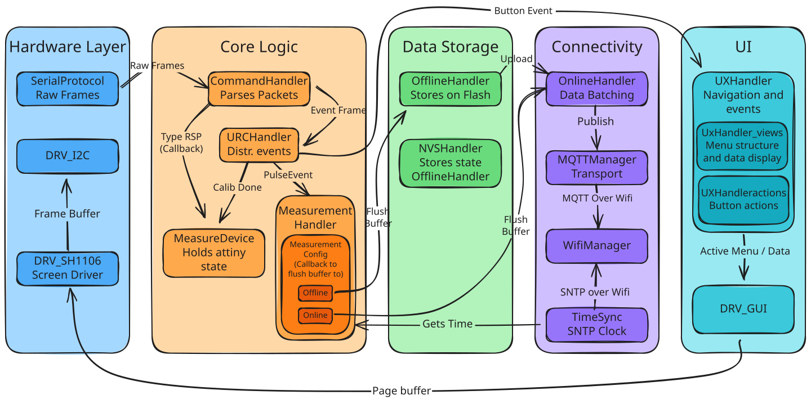

# Coulomb Counter - Alfex Technologies - 09-2025 t/m 02-2026

**Mijn Rol:** Solo Embedded Software Engineer (Stage bij Alflex Technologies)

Alflex Technologies ontwerpt en produceert ultra-low-power IoT-apparaten die jarenlang autonoom op een enkele batterij moeten functioneren. Om de levensduur te garanderen is langdurig en accuraat meten van het stroomverbruik essentieel.

Industriële oplossingen zoals de Joulescope JS110 zijn zeer accuraat, maar vereisen een constante pc-verbinding en de software wordt instabiel bij tests die langer dan 12 uur duren en vereisen enorm veel opslag. Mijn opdracht was het doorontwikkelen van een bestaand intern prototype tot een solide, autonome Coulomb Counter (bestaande uit een ATtiny1616 meet-module en een ESP32-S3 control-module) die weken- of maandenlang "sluipstroom-bugs" in het veld kan opsporen.

## De AI Valkuil

Dit project was een enorme technische realitycheck. In de eerste weken van mijn stage leunde ik zwaar op AI-gegenereerde code om de complexe communicatie en RTOS-taken (Real-Time Operating System) op te zetten. Dit resulteerde in onstabiele spaghetti-code en onverklaarbare stack overflows. Tijdens een stevige, maar terechte code review werd duidelijk dat mijn fundamentele kennis van C onvoldoende was voor dit niveau van embedded engineering.

Na deze reality check heb ik de ontwikkeling twee weken volledig stilgelegd. Ik ben in de theorie gedoken om de taal écht te doorgronden. Ik heb [Brian "Beej" Halls](https://beej.us/guide/bgc/pdf/bgc_a4_bw_1.pdf) werk doorgelezen en oefeningen gedaan. Daarna heb ik de firmware vanaf de grond af opnieuw opgebouwd. Ik verving de foutgevoelige RTOS-taken door een voorspelbare, simpelere, non-blocking superloop architectuur. Dynamische geheugenallocatie (malloc) heb ik niet gebruikt om heap-fragmentatie te voorkomen (externe libraries natuurlijk wel, maar ik zelf niet). Het resultaat was een firmware die niet meer crashte en waar ik 100% controle over had.

## Systeemarchitectuur & Datastromen

De data stroomt van de ruwe hardware-interrupts helemaal naar een cloud-dashboard. Hieronder is de volledige workflow van de firmware te zien.  

## Belangrijke Doorbraken

Tijdens het onderzoek en de realisatie heb ik een aantal kritieke architectuurkeuzes moeten maken om de stabiliteit en efficiëntie te waarborgen.

### Pragmatische Data-acquisitie (UART vs. PCNT)

Hoe tel je tot 62.000 pulsen per seconde op een ESP32 zonder de CPU te overbelasten?

* **Directe CPU-interrupts** bleken direct onhaalbaar; de CPU trok dit simpelweg niet naast de Wi-Fi en display-taken.
* **De ESP32 PCNT (Pulse Counter) module** was hardwarematig ideaal (geen CPU-belasting, 10ms resolutie), maar in de praktijk zorgden Wi-Fi-interrupts voor timing-afwijkingen van 1 tot 10%, wat de grafieken onbruikbaar maakte.  
* **De pragmatische keuze (UART):** Uiteindelijk koos ik ervoor om de ATtiny1616 het telwerk te laten doen. Deze aggregeert de pulsen en stuurt elke 100ms een update via UART naar de ESP32. Dit kostte iets aan tijdsresolutie, maar garandeerde 100% stabiliteit en betrouwbaarheid binnen de tijdlijn van het project.

### De Hybride Backend (InfluxDB + MariaDB)

De meter genereert een enorme stroom aan tijdsreeksdata. InfluxDB (een Time-Series Database) is hiervoor perfect, maar het heeft één grote zwakte: *High Cardinality*. Als je te veel unieke metadata (zoals firmwareversies, testnamen of apparaat-ID's) als 'tags' opslaat, crasht de database door een overvloed aan index-sleutels.

Mijn oplossing was een hybride architectuur. Een MariaDB (SQL) database slaat alle context en metadata van de test op en genereert een unieke UUID. InfluxDB slaat vervolgens alléén de ruwe meetdata op, gekoppeld aan diezelfde UUID. Grafana (het visualisatieplatform) voegt deze twee werelden naadloos samen via 'dashboard variables', waardoor engineers eenvoudig complexe queries kunnen draaien zonder dat de backend overbelast raakt.

## **Validatie & Acceptatiecriteria**

Een meetinstrument is nutteloos als de data niet klopt. Om de accuraatheid van de Coulomb Counter te bewijzen, heb ik een uitgebreid testprotocol ontworpen.
Het apparaat werd in een gesloten serieschakeling geplaatst met de Joulescope JS110 (de industriestandaard). Omdat de Joulescope via zeer snelle MOSFETs schakelt tussen shuntweerstanden, bedraagt de *burden voltage* (spanningsval) slechts maximaal 25mV op 1 Ampère, wat de test niet beïnvloedt. De Coulomb Counter is getest over het volledige dynamische bereik (van 0,1 µA slaapstroom tot 2A actieve piekstroom) met een harde acceptatiegrens: de gemeten waarden mochten **maximaal 1% afwijken** van de Joulescope over een duurtest van 100+ uur. Dit is gelukt!

## Gerelateerde Documenten

[MQTT Protocol Spec](mqtt-protocol-spec.md) is een document geschreven voor dit project en beschrijft de gedachtes achter het MQTT Protocol. Verder is de offline mode en de manier hoe data opgeslagen wordt beschreven in [Flash Storage](flash-storage.md), wat een stuk uit mijn onderzoeksverslag is.
