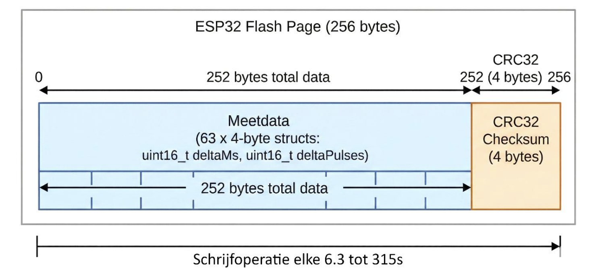

# Lokale dataopslag voor offline modus

!!! note "Onderzoeksverslag"
    Deze pagina is een stuk uit mijn onderzoeksverslag voor Alflex.
    Dit document is in originele staat hier te lezen om mijn onderzoeksvaardigheden te tonen.

Deelvraag 5 luidt:
> Hoe kan gemeten data effectief lokaal worden opgeslagen en beheerd op de
> ESP32, die zelf beperkte opslagcapaciteit heeft, voor langdurige, autonome
> metingen, terwijl de datakwaliteit zo hoog mogelijk blijft?

## 3.5.1 Wat is het doel van de offline modus?

Uit gesprekken met medewerkers van Alflex blijkt dat de offline modus vooral
belangrijk is in drie situaties:

- Apparaten moeten ook getest kunnen worden zonder connectiviteit. De vraag is
  wat er gebeurt als een apparaat zijn thuisbasis niet kan vinden: is dat goed
  geïmplementeerd, of verspilt het apparaat onnodig energie?
- Er moet snel getest kunnen worden in het veld. Als een module bijvoorbeeld
  afwijkend gedrag vertoont, kan een Coulomb Counter tijdelijk worden
  aangesloten, bijvoorbeeld in een auto, om gedurende enkele uren te meten wat
  er precies gebeurt.
- Als de wifi-verbinding bijvoorbeeld zes uur wegvalt, mag een meting die al
  zeven dagen loopt niet direct ongeldig worden. Het apparaat moet blijven
  meten, desnoods op een lagere resolutie.

In alle drie de situaties wordt de data later, zodra er weer internetverbinding
beschikbaar is, gesynchroniseerd met de backend.

Deze data moet lokaal worden opgeslagen. Er is echter geen SD-kaart of externe
flashmodule beschikbaar. Daarom moet gebruik worden gemaakt van de interne
SPI-flash van de ESP32, die in dit geval 8 MB groot is. Dit type opslag heeft
een beperkt aantal schrijfcycli. Voor deze module ligt dat aantal rond de
100.000 cycli (Espressif, z.d.). Daardoor moet zorgvuldig worden omgegaan met
hoe vaak het geheugen wordt aangepast. In de praktijk is het realistisch om uit
te gaan van ongeveer 4 MB beschikbare opslagruimte, omdat het programma en de
bootloader ook ruimte in het flashgeheugen gebruiken.

## 3.5.2 Welke data moet worden opgeslagen?

De data in de offline modus hoeft niet dezelfde resolutie te hebben als de data
in de online modus. De online modus genereert momenteel maximaal 40 bytes per seconde aan data als
er elke 100 milliseconde een puls wordt geregistreerd. Als het apparaat
slechts elke 5 seconden een puls stroom gebruikt, komt dit neer op 0,8 bytes per
seconde.

Over een periode van 24 uur betekent dit een datagrootte van ongeveer 67,5 KB
tot 3375 KB.

## 3.5.3 Analyse: bestandssysteem versus ruwe partitie

Er zijn twee methodes overwogen om data naar de interne flash te schrijven:

### LittleFS

LittleFS is een robuust bestandssysteem met bescherming tegen stroomverlies.
Hoewel dit veilig is, introduceert het overhead in de vorm van metadata per
schrijfactie. Omdat de meetdata bestaat uit vaste pakketjes van 4 bytes
(`PulseEvent_t`), is de overhead van een bestandssysteem relatief groot. Ook is
de extra abstractielaag in dit geval onnodig complex.

Wear leveling wordt bij LittleFS automatisch geregeld. Andere bestandssystemen
hebben echter een vergelijkbaar probleem met overhead.

### Sequentiële buffer op een ruwe partitie

Bij deze methode wordt een specifiek deel van het flashgeheugen gereserveerd als
datapartitie. De software schrijft de binaire data, in de vorm van structs,
direct en sequentieel weg.

Deze aanpak is foutgevoeliger dan LittleFS, omdat LittleFS corrupte data zelf
kan detecteren en beheren. Daar staat tegenover dat een ruwe partitie minder
overhead heeft en meer controle geeft over de opslagstructuur.

In overleg met senior engineers is gekozen voor de sequentiële buffer. Omdat de
data een vaste structuur heeft, namelijk:

```c
uint16_t deltaMs;
uint16_t deltaPulses;
```

kan deze zonder bestandssysteem-overhead worden opgeslagen. Dit maximaliseert de
opslagcapaciteit en geeft volledige controle over wear leveling. Door de ESP32
zo te programmeren dat deze verder schrijft waar de vorige meting is gestopt,
wordt ervoor gezorgd dat elke sector ongeveer even vaak beschreven wordt.

## 3.5.4 Aggregatie

De eis uit deelvraag 1 is dat het apparaat tot één maand offline moet kunnen
meten. Dat is niet haalbaar met de standaardresolutie van 100 ms, omdat dit 2 MB
tot 100 MB opslagruimte zou vereisen. De beschikbare opslag op de ESP32 is
echter beperkt tot ongeveer 4 MB.

Om dit op te lossen wordt aggregatie toegepast. De software op de ESP32 vangt de
100 ms-berichten van de meetmodule op en telt de pulsen op in een tijdelijke
buffer. Pas nadat een instelbaar interval is verstreken, worden de totaalsom van
de pulsen en de verstreken tijd naar het geheugen geschreven.

De onderstaande tabel toont de relatie tussen het interval en de maximale
opslagduur. Deze berekeningen gaan uit van een worstcasescenario waarin het
gemeten apparaat continu actief is en er bij elk interval data wordt
weggeschreven. Bij zuinige apparaten wordt minder data opgeslagen, waardoor de
opslagduur langer is.

| Tijdsresolutie / interval | Opslagduur    | Conclusie                      |
| ------------------------- | ------------- | ------------------------------ |
| 100 milliseconden         | 29 uur        | Hoge resolutie, te veel data   |
| 1 seconde                 | 12,1 dagen    | Haalt een week, wel veel data  |
| 3 seconden                | 36,4 dagen    | Haalt de maand, precies goed   |
| 5 seconden                | 60,6 dagen    | Haalt bijna twee maanden       |

De aanname hierbij is 4 MB beschikbare opslag en 4 bytes per datapunt.

Door de resolutie instelbaar te maken, kan de gebruiker zelf kiezen met welke
tijdsresolutie de meting wordt uitgevoerd. Deze keuze moet wel duidelijk worden
gecommuniceerd aan de gebruiker.

## 3.5.5 Het opslaan van geaggregeerde data op flash

Schrijven naar flash gebeurt niet direct. Volgens de datasheet kan een
schrijfactie 0,8 tot 5 milliseconden duren. Dit is relatief snel in vergelijking
met het wissen van data, wat 70 tot 500 milliseconden kan duren.

De ESP32 kan beschreven sectoren niet overschrijven zonder deze eerst te wissen.
Deze wisactie is dus vereist. Flashoperaties blokkeren de CPU, omdat de ESP32
dezelfde flash gebruikt voor zowel opslag als programmacode.

Een schrijftijd van 0,8 tot 5 milliseconden is kort genoeg om geen grote impact
te hebben op de superlooparchitectuur. De wistijd van 70 tot 500 milliseconden
is echter te lang. Dit kan zelfs impact hebben op wifi en MQTT, waardoor de
verbinding mogelijk wordt verbroken.

Dit betekent dat het overschrijven van flash tijdens dezelfde meting niet
geschikt is. Elke offline meting kan daarom slechts duren totdat de beschikbare
opslag vol is. Zodra de opslag vol is, stopt de meting.

## 3.5.6 Beheer van de opslagcyclus

De flash moet uiteindelijk worden gewist om ruimte te maken voor een volgende
meting. Dit gebeurt na het uploaden van alle data. Op dat moment is er voldoende
tijd om de flash te wissen, ook als dit tientallen seconden duurt. Als de
gebruiker hierover duidelijk wordt geïnformeerd, vormt deze wachttijd geen
probleem.

Bij het versturen van de data moet het begin en het einde van de meting duidelijk
zijn. Anders bestaat het risico dat corrupte of onvolledige data wordt verstuurd.
Dat moet worden voorkomen.

Schrijven naar flash is het efficiëntst wanneer een volledige pagina van 256
bytes in één keer wordt geschreven. Aangezien één meting 4 bytes groot is, passen
er 64 metingen in één pagina. Door te bufferen en steeds 64 metingen tegelijk te
schrijven, past de data precies in de paginagrootte van de ESP32-flash.

Afhankelijk van de ingestelde resolutie leidt dit tot één schrijfoperatie per
6,4 tot 320 seconden. Hierdoor wordt de CPU zo weinig mogelijk geblokkeerd en
blijft het aantal schrijfcycli ruim onder de limiet van 100.000.

Zelfs in de meest agressieve modus van 10 Hz wordt elke fysieke sector slechts
ongeveer eens per 1,2 dagen gewist. Theoretisch zou de chip hierdoor ongeveer
330 jaar meegaan, wat ver voorbij de verwachte levensduur van het apparaat ligt.
De limiet van 100.000 cycli vormt in deze configuratie dus geen praktisch
risico.

Door het bufferen in RAM kan bij stroomverlies de laatste 6,4 tot 320 seconden
aan data verloren gaan. Dit is een acceptabele concessie om sneller en
efficiënter naar flash te schrijven. De offline metingen duren tussen 29 uur en
60 dagen, waardoor dit verlies relatief klein is. Bovendien betekent
stroomverlies volgens de eisen van Alflex dat de meting eindigt.

## 3.5.7 Detectie van corrupte data

Omdat de data wordt opgeslagen in een sequentiële buffer op flash, is er ook een
manier nodig om corruptie te detecteren en eventueel te corrigeren. LittleFS zou
dit normaal gesproken zelf doen, maar dat brengt extra metadata met zich mee die
in deze toepassing niet nodig is. Door zelf metadata toe te voegen, blijft de
controle over de opslagstructuur behouden.

Voor elke pagina van 256 bytes is het nuttig om één of meerdere CRC-bytes op te
slaan. Daarmee kan worden gecontroleerd of de pagina correct is geschreven.

Hierbij ontstond een ontwerpdilemma over foutafhandeling: moet het systeem
kunnen blijven functioneren na detectie van een invalide CRC-check?

### Optie 1: doorgaan na een CRC-fout

In dit scenario zouden extra bytes aan het einde van de pagina worden
gereserveerd om herstel mogelijk te maken. Bijvoorbeeld door de totale
pulstelling op te slaan in een `uint32_t` en de totale tijd in seconden in een
`uint16_t` van de vorige pagina. Als de CRC-check van de vorige pagina faalt,
kan met deze waarden verder worden opgebouwd. Het enige verlies is dan
tijdsresolutie.

Dit is één mogelijke oplossing. Er zijn meerdere manieren om dit probleem op te
lossen, maar deze aanpak leek het meest logisch.

### Optie 2: stoppen bij een CRC-fout

In dit scenario is de meting geldig tot het punt waarop de CRC-check faalt. Er
wordt vervolgens een foutmelding op het scherm getoond. De gebruiker kan de
meting daarna verwijderen nadat de melding is gelezen. Een CRC-fout kan erop
wijzen dat de flash op de chip beschadigd is of dat een schrijfactie niet
correct is afgerond.

Alflex heeft gekozen voor de eenvoudige oplossing. De laatste 4 bytes van elke
pagina bestaan uit een 32-bit CRC. Deze CRC wordt berekend op het moment dat de
pagina wordt opgeslagen en geverifieerd wanneer de data naar de backend wordt
verstuurd.



Per pagina gaat hierdoor exact één meting aan capaciteit verloren aan de
checksum. Dit komt neer op een reductie van de totale opslagcapaciteit van
1,56%. Dit verlies is verwaarloosbaar in ruil voor betere data-integriteit. De
schrijfoperatie naar flash vindt nu plaats na elke 63e meting in plaats van na
elke 64e meting.

De onderstaande tabel toont het effect van de CRC op de opslagduur en het
opslaginterval.

| Tijdsresolutie / interval | Opslagduur met CRC | Opslaginterval met CRC | Verlies door CRC | Conclusie                                        |
| ------------------------- | ------------------ | ---------------------- | ---------------- | ------------------------------------------------ |
| 100 ms                    | 28,7 uur           | 6,3 seconden           | -25 minuten      | Nog steeds ruim een dag, acceptabel verlies      |
| 1 seconde                 | 11,9 dagen         | 63 seconden            | -4,5 uur         | Net geen 12 dagen, ruim voldoende voor weektests |
| 3 seconden                | 35,8 dagen         | 189 seconden           | -13,6 uur        | Haalt nog steeds ruim de maand                   |
| 5 seconden                | 59,7 dagen         | 315 seconden           | -22,8 uur        | Haalt nog steeds bijna twee maanden              |

*De getoonde opslagduur is gebaseerd op een worstcasescenario. In de praktijk kan
de opslagduur langer zijn, bijvoorbeeld bij een zuinig apparaat dat minder vaak
actief is.*

Bij een herstart na stroomverlies is de actuele schrijfpositie, die in het
werkgeheugen wordt opgeslagen, verloren gegaan. De ESP32 herstelt deze positie
door het flashgeheugen sequentieel te scannen, beginnend bij het startadres van
de meting. Dit startadres ligt vast in NVS.

De software zoekt hierbij naar het eerste geheugenblok dat volledig uit
`0xFF`-bytes bestaat. Dit is de indicator voor onbeschreven flashgeheugen.

Zodra dit punt is bereikt, wordt ter verificatie de CRC-checksum van de laatst
geschreven pagina gevalideerd. Dit is de pagina direct vóór de `0xFF`-reeks. Als
deze CRC klopt, is bevestigd dat de laatste schrijfactie vóór de stroomuitval
succesvol was.

Hoewel de meting daarna niet kan worden hervat, blijft de meetdata beschikbaar
voor upload naar de backend. Als alternatief kan de gebruiker de data
verwijderen om ruimte te maken voor een nieuwe meting.

## 3.5.8 Conclusie

De meest effectieve manier om data lokaal op te slaan op de ESP32 is door
gebruik te maken van een ruwe partitie op de interne flash, zonder de overhead
van een bestandssysteem. Dit minimaliseert de opslagoverhead en maximaliseert de
beschikbare ruimte.

Door de meetdata te aggregeren, bijvoorbeeld naar intervallen van 3 seconden,
kan worden voldaan aan de eis om tot één maand autonoom te meten binnen de
beschikbare 4 MB opslagruimte.

De levensduur van de flashchip wordt gewaarborgd door lineair te schrijven,
waardoor elke sector ongeveer even vaak wordt beschreven. De data-integriteit,
die normaal door LittleFS zou worden beheerd, wordt in deze oplossing
gegarandeerd door het toevoegen van een 32-bit CRC-checksum aan het einde van
elke pagina.
