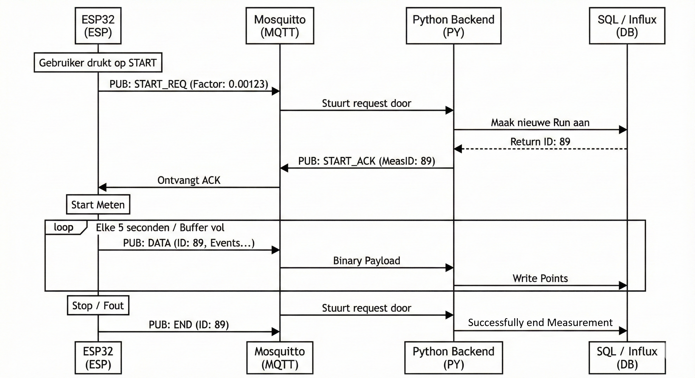

# MQTT Telemetry Protocol (Binary)

## Doelstelling

Het apparaat moet data versturen richting de backend zodat het in de InfluxDB database kan komen. Hierbij moet lossless data opgestuurd worden en na pakketverlies moet er alleen tijdsresolutie verloren gaan, geen data.

### Criteria

1. De ESP32 mag geen data versturen naar een niet luisterende backend. Er is een handshake nodig.
2. Een pakketverlies mag niet de hele meting invalideren.
3. Geen `float` accumulatie op de ESP32
4. Elk bericht moet volledig self containing zijn (inclusief calibratie-factor en Run ID).
5. Minimale overhead (binair packed struct, geen JSON).

## 1. De Architectuur (Handshake)

Om te voorkomen dat de ESP32 meet terwijl de database/MQTT luisteraar offline is, wordt er een strikte *Start Request* flow gebruikt.



De ESP stuurt `START_REQ` elke 2 seconden opnieuw totdat `START_ACK` ontvangen is. Als dit te lang duurt (10+ seconden) of het apparaat heeft sowieso geen verbinding met de MQTT broker, dan wordt dit aan de gebruiker getoond.

## 2. Het Data Protocol

Het protocol is een binair protocol om overhead van tekstgebaseerde protocollen te vermijden. Alles is Little Endian volgorde en

### Header (Fixed - 32 Bytes)

Elk pakket begint met deze header. Dit bevat de "Anchor" waarden waarmee de backend altijd de absolute waarheid kan reconstrueren, zelfs als er pakketten missen.

| Offset | Veld              | Type     | Grootte | Uitleg                           |
| :----- | :---------------- | :------- | :------ | :------------------------------- |
| 0      | **Version**       | `uint8`  | 1       | Protocol Versie (Fixed: `0x01`). |
| 1      | **Type**          | `uint8`  | 1       | Command Type (zie Enums).        |
| 2      | **Seq ID**        | `uint16` | 2       | Volgnummer voor packet loss.     |
| 4      | **Meas ID**       | `uint32` | 4       | Database Primary Key (Run ID).   |
| 8      | **Timestamp**     | `uint64` | 8       | Tijd start van batch (µs).       |
| 16     | **Totale pulsen** | `uint64` | 8       | Totale pulsen sinds start.       |
| 24     | **Factor**        | `double` | 8       | Conversie: Coulombs per Pulse.   |

Totaal is 32 bytes. Velden 8 t/m 31 (Timestamp, Pulses, Factor) zijn niet relevant voor ACK en worden genegeerd/op 0 gezet. Ze worden wel verstuurd voor de header, maar niet uitgelezen. Het is zo simpeler om te implementeren.

### Packet Types (Enums)

De waarden voor het `Type` veld op offset 1:

| Waarde | Naam        | Omschrijving                                             |
| :----- | :---------- | :------------------------------------------------------- |
| `0x01` | `START_REQ` | ESP vraagt toestemming (Payload leeg, Factor in header). |
| `0x02` | `START_ACK` | Backend geeft toestemming (Meas ID ingevuld).            |
| `0x03` | `DATA`      | Bevat meetgegevens (Header + Body).                      |
| `0x04` | `END`       | Meting voltooid.                                         |

### Body (Variable - Alleen bij `DATA`)

Direct na de 32-byte header volgt een array van events van vier bytes.
Er zullen nooit meer dan 250 events in deze array zitten, om de pakketgrootte te limiteren en om te zorgen dat de grafiek in Grafana niet veel achter de realiteit hangt.
Ook belangrijk: een `uint16` max is 65,535ms (~65 seconden). Als er langer geen event is, moet er een leeg datapakket opgeslagen/verstuurd worden om overflow te voorkomen. Dit is al geïmplementeerd in de ``MeasurementHandler`` op de coulombcounter.

| Veld             | Type     | Grootte | Uitleg                                  |
| :--------------- | :------- | :------ | :-------------------------------------- |
| **Delta Time**   | `uint16` | 2       | Milliseconden *vanaf* Header Timestamp. |
| **Delta Pulses** | `uint16` | 2       | Aantal pulsen in dit tijdsvenster.      |

### Protocol overhead

Met een laag stroomverbruik wordt er nu dus wel extra data verstuurd met de 32-byte header. Stel je hebt maar elke 5 secondes een puls, dan verstuur je elke 5 secondes 32 bytes aan header en 4 bytes aan echte payload data.

Dit klinkt als veel overhead, maar in de praktijk is dit niet bepaald een probleem, aangezien we wifi gebruiken. MQTT en TCP voegen ook nog extra overhead toe, wat veel groter zal zijn dan ons 38 byte berichtje, dus het besparen om toch nog wat bytes niet te hoeven versturen betekent alleen dat de robuustheid van het protocol omlaag gaat.

## 3. Implementatie Details

### C Structuur (ESP32)

 `__attribute__((packed))` wordt gebruikt padding van de compiler te voorkomen.

```c
typedef struct {
    // --- CONTROL BLOCK (4 Bytes) ---
    uint8_t  version;       // 0x01
    uint8_t  packetType;    // Enum
    uint16_t sequenceId;    // Tegen duplicaten/gaps

    // --- ID BLOCK (4 Bytes) ---
    uint32_t measurementId; // Ontvangen van ACK

    // --- ANCHOR BLOCK (24 Bytes) ---
    uint64_t baseTimestampUs; // esp_timer_get_time() (of start block!!)
    uint64_t baseTotalPulses; // De "Odometer"
    double   coulombFactor;   // Config settings
} __attribute__((packed)) MeasurementPacketHeader_t;

typedef struct {
    uint16_t deltaMs;
    uint16_t deltaPulses;
} __attribute__((packed))PulseEvent_t;

```

#### Waar moet de embedded kant op letten?

Momenteel wordt de rollover van ``deltaPulses`` (65s) gehandeld wanneer er weer een puls binnenkomt. Als er voor een zeer lange tijd geen pulsen meer binnenkomen, stuurt de ESP32 ook niks meer op. Dit kan ervoor zorgen dat bij een extreem zuinig apparaat (nA) dat de backend geen update meer krijgt voor meerdere uren.

Dit is niet meer mogelijk dus de `MeasurementHandler` moet herschreven worden zodat dit wordt gedaan in de main loop, zodat minstens elke 65535 ms er een bericht wordt gestuurd naar de backend.

### Python Decoding

Struct format string voor de parser:

```python
# Header: 32 bytes
# < = Little Endian
# B = u8, H = u16, I = u32, Q = u64, d = double
HEADER_FMT = '<BBHIQQd'

# Event: 4 bytes
EVENT_FMT  = '<HH'
```

#### Waar moet de backend op letten?

Sequence ID gaat overflowen na 65535 berichtjes (~3.7 dagen op 5s p. bericht). Dit betekent dat de backend dit veilig moet afhandelen.

## 4. Data Reconstructie

Hoe worden er van bytes fysieke waardes gemaakt (Amps) in de backend?

**1. Totaal Lading (Coulombs)**
De integer "totalPulses" wordt vermenigvuldigd met de factor. Dit voorkomt drift door floats op de microcontroller.
$$
TotaalCoulombs = (Header.TotalPulses + \sum Event.DeltaPulses) \times Header.Factor
$$

**2. Stroomsterkte (Ampère)**
Stroom is lading per tijdseenheid ($I = Q/t$).
$$
Ampere_{event} = \frac{Event.DeltaPulses \times Header.Factor}{Event.DeltaMs / 1000.0}
$$
