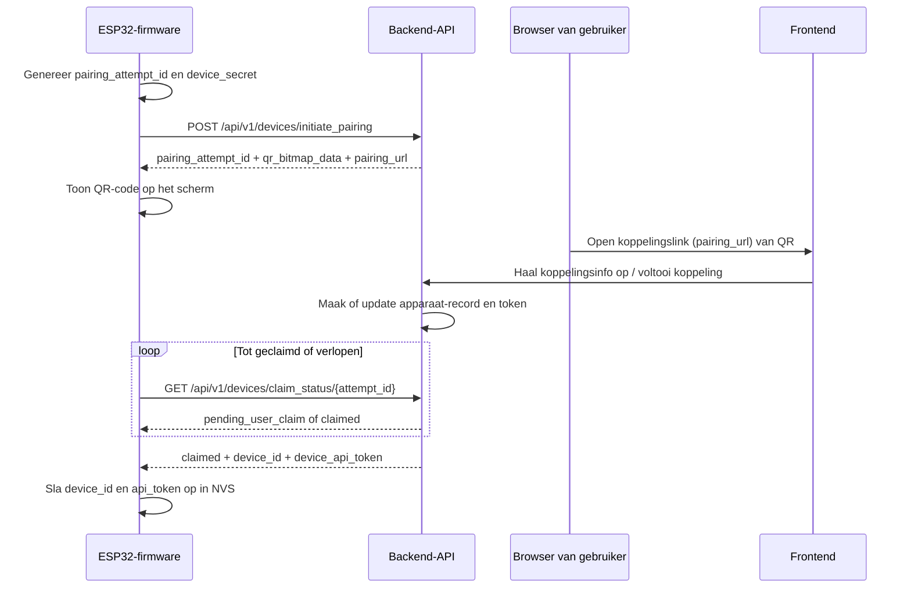

# StratusDash Pairing Architectuur

Dit document beschrijft hoe een StratusDash-apparaat koppelt met een account. We behandelen hierin de firmware, de backend en de web-UI.

In het kort gebeurt het volgende:

- Het apparaat genereert een koppelpoging-ID en een high-entropy secret, en doet een API-verzoek naar de backend.
- De backend maakt een koppelpoging aan, slaat een hash van de device secret op en stuurt een QR-code terug naar het apparaat.
- De QR-code wordt getoond op het apparaat en bevat de koppelingslink met de koppelpoging.
- De gebruiker scant de QR-code, maakt een account aan (of logt in) en koppelt het apparaat. De koppelpoging-ID is sticky, dus de gebruiker hoeft de QR-code maar één keer te scannen.
- Het apparaat vraagt ondertussen (elke 10 seconden) de backend met de koppelpoging-ID en de device secret om te controleren of het al gekoppeld is.
- Zodra het apparaat gekoppeld is, stuurt de backend een API-token en een apparaat-ID mee. De firmware slaat deze gegevens op.

## Het Doel

Het koppelproces is ontworpen om het volgende te doen:

1. Een fysiek apparaat koppelen met de backend.
2. De gebruiker eigendom van het apparaat laten bevestigen d.m.v. de website.
3. Niet toestaan dat iemand die de link ziet een device token kan stelen.
4. Opslaan van deze device token zodat het apparaat niet elke keer opnieuw moet koppelen.

## De High Level Flow

## De Firmware

Hier beschrijven we de firmware-kant van het proces.

### 1. Wanneer start het koppelproces?

Het koppelproces start in `main.cpp` als het apparaat WiFi heeft en geen geldige device-token heeft.

Als het apparaat wel een device-token bezit zal het altijd optimistisch proberen om data op te vragen. Mocht daaruit blijken dat de device-token invalide is zal het opnieuw pairing starten.

### 2. De firmware genereert twee dingen

De firmware genereert:

- `pairing_attempt_id`: Een UUID v4, dat gebruikt voor de koppellink.
- `device_secret`: Een 64-karakter high-entropy string van `esp_random()`.

De device secret wordt niet getoond aan de gebruiker in de QR code of elders.

### 3. De firmware maakt contact met de backend

De firmware stuurt een JSON payload met:

- `hardware_id`
- `pairing_attempt_id`
- `device_secret`
- `pairing_locale`

Dit request gaat naar  `POST /api/v1/devices/initiate_pairing`.

Waarbij de backend reageert met:

- de echte `pairing_attempt_id`
- `qr_bitmap_data`, een base64-encoded 1-bit bitmap
- `pairing_url`, wat de koppelpoging-ID bevat
- `expires_at` (tijdstip, 20 minuten in de toekomst)

### 4. Het apparaat toont de QR code

De firmware zet de base64 string om naar een QR code en rendert dit op het scherm. De QR code stuurt de gebruiker naar de website, waarbij de gebruiker kan inloggen en kan koppelen.

### 5. Het apparaat vraagt periodiek de claim status

Terwijl het apparaat wacht op de gebruiker vraagt de firmware elke 10 seconden:

- `GET /api/v1/devices/claim_status/{attempt_id}`

De firmware voegt de device secret toe in de header:

- `X-Device-Pairing-Secret: <device_secret>`

Het apparaat vraagt dit elke 10 seconden op totdat het apparaat gekoppeld is.

### 6. Het apparaat is gekoppeld

Als de gebruiker via de website het apparaat succesvol heeft gekoppeld, stuurt de backend de claim-status claimed terug, inclusief het volgende:

- `device_id`
- `device_api_token`

De firmware slaat dit op en begint met de normale functionaliteit.

## De backend

De backend zorgt ervoor dat het apparaat opgeslagen wordt, beslist en handelt de claim af en genereert de device token.

### 1. Initiatie maakt een openstaande koppelpoging aan

`POST /api/v1/devices/initiate_pairing` doet het volgende:

- Wijst het verzoek af als de hardware-ID al is gekoppeld.
- Maakt een record aan voor een openstaande koppelpoging.
- Slaat een SHA-256 hash op van de `device_secret`, niet de device secret zelf.
- Wijst een vervaltijd toe, momenteel 20 minuten.
- Genereert een QR-code die verwijst naar de koppelingspagina op de frontend.

Dit endpoint is rate-limited om misbruik te voorkomen.

### 2. Polling van de claim-status verifieert de device secret

`GET /api/v1/devices/claim_status/{attempt_id}` leest de pairing device secret uit de `X-Device-Pairing-Secret` header.

De backend doet vervolgens het volgende:

- zoekt de openstaande poging op via de ID,
- hasht de meegestuurde device secret,
- vergelijkt deze met de opgeslagen hash,
- retourneert `forbidden` als de device secrets niet overeenkomen,
- retourneert `pending_user_claim` als de gebruiker het koppelen nog niet heeft voltooid,
- retourneert `claimed` zodra er een apparaat-record bestaat voor de hardware-ID.

Dit is de belangrijkste vertrouwensgrens (trust boundary) in het ontwerp. De publieke koppelpoging-ID identificeert de koppelingssessie, maar de `device_secret` bewijst dat de aanroeper het daadwerkelijke, originele apparaat is.

### 3. Voltooiing door de gebruiker genereert de device token

Wanneer de gebruiker de koppeling in de webapp bevestigt, maakt de backend het apparaat-record aan (of updatet deze) en genereert het een nieuwe, langdurig geldige API-token met `secrets.token_urlsafe(32)`.

Deze token wordt pas naar het apparaat teruggestuurd nadat de claim is voltooid.

## De rol van de Frontend

De QR-code leidt de gebruiker naar de koppelingspagina in de frontend.

De frontend is verantwoordelijk voor de menselijke goedkeuringsstap:

- het toont apparaatinformatie voor de openstaande poging,
- het laat de gebruiker het apparaat een naam geven en een locatie,
- het verstuurt het definitieve claim-verzoek naar de backend.

De frontend genereert de device-token *niet*. Dat blijft een verantwoordelijkheid van de backend.

## Behoud van de Koppelpoging-ID via E-mail (Stickiness)

Er is nog één extra route waarbij de koppelpoging-ID intact moet blijven: de overdracht tijdens registratie en e-mailverificatie.

Dit maakt geen deel uit van het daadwerkelijke koppelen van het apparaat, maar is belangrijk omdat de gebruiker vaak een account moet aanmaken of verifiëren voordat hij of zij het koppelen kan voltooien.

### Hoe de ID behouden blijft

De registratie-flow in de frontend accepteert een veilige lokale redirect terug naar `/pair?attemptId=...`.

- Op de registratiepagina accepteert de frontend alleen een same-origin redirect die verwijst naar `/pair` en de `attemptId` bevat.
- De registratiepagina stuurt die redirect mee in het verzoek voor het aanmaken van een account.
- De login/registratie-flow in de backend neemt dezelfde veilige koppel-redirect op bij het opbouwen van de e-mailverificatielink.
- De verificatie-e-mail zelf is gewoon een standaard verificatiemail; het verzint geen nieuwe koppelpoging-ID.
- Nadat de verificatie is geslaagd, leest de frontend de `uuid` parameter en stuurt het de gebruiker terug naar `/pair?attemptId=<uuid>`.

### Waarom dit 'sticky' is

De koppelpoging-ID wordt behandeld als routing-status. Het overleeft deze overgangen:

1. De gebruiker start vanuit een koppel- of registratieroute die de koppelpoging-ID al kent.
2. De frontend neemt die ID mee in een veilige redirect.
3. De backend voegt de redirect toe aan de verificatielink in de e-mail.
4. Nadat de gebruiker de e-mail heeft geverifieerd, stuurt de frontend hem terug naar de koppelingspagina, waarbij de originele koppelpoging-ID is hersteld.

### Waarom dit ontwerp bestaat

Het doel is om te voorkomen dat de gebruiker de QR-code opnieuw moet scannen na het verifiëren van het account. Het houdt de koppelpoging stabiel tijdens de omweg van het aanmaken van een account, terwijl de redirect veilig beperkt blijft tot een lokale `/pair` URL.

### Wat de backend niet doet

De backend genereert de koppelpoging-ID niet voor de e-mail-flow. Het behoudt alleen een door de gebruiker aangeleverde, veilige redirect die de koppelpoging-ID al bevat. Dat betekent dat de frontend de continuïteit van de koppel-context beheert, terwijl de backend het redirect-pad alleen valideert en terugkaatst.

## Persistente Opslag

De gekoppelde status wordt opgeslagen in het ESP32 NVS-geheugen onder de `stratusdash` namespace. De huidige credential keys zijn:

- `api_token`
- `device_id`

Bij het opstarten laadt de firmware deze keys in en beschouwt het apparaat als geauthenticeerd als beide aanwezig zijn. Andere apparaatinstellingen gebruiken een aparte `device_config` namespace, zodat deze inloggegevens geïsoleerd zijn van de normale dashboard-configuratie.

## State Machine

Op praktisch niveau doorloopt het apparaat deze statussen:

1. Niet gekoppeld.
2. Koppeling geïnitieerd.
3. Wachten op claim van gebruiker.
4. Geclaimd en geauthenticeerd.
5. Toekomstige reboots gebruiken de opgeslagen inloggegevens.

Als de koppeling een time-out bereikt of de backend meldt dat deze is verlopen, mislukt de flow en moet deze opnieuw worden gestart.

## Verlooptijden en Retry-gedrag

Openstaande pogingen verlopen na 20 minuten in de backend. Aan de kant van het apparaat heeft de koppeling ook een lokale time-out van 20 minuten, zodat de firmware niet oneindig blijft pollen. Als een koppelpoging verloopt, toont het apparaat een fout- of time-outscherm en moet de gebruiker het apparaat opnieuw opstarten om het nog eens te proberen.

Als de backend meldt dat het apparaat al is gekoppeld, toont de firmware een koppelingsfout in plaats van door te gaan.

## Beveiligingseigenschappen

De device secret maakt het koppelen extra veilig. Zonder die extra device secret zou iedereen die de QR-URL kopieert het claim-status endpoint kunnen pollen, en zo een raceconditie met het apparaat aan kunnen gaan om de uiteindelijke token te stelen.

Met het huidige ontwerp vereist de backend bewijs dat de aanroeper de originele device secret kent, voordat de token wordt teruggestuurd.

### Resterende risico's

De uiteindelijke device-API-token is nog steeds een langdurig geldige bearer secret en wordt als plaintext opgeslagen in ESP32 NVS. Dat is acceptabel voor de huidige MVP-architectuur, maar het betekent wel dat iedereen met fysieke toegang tot het flashgeheugen of met een firmware-dump de token kan bemachtigen. Deze token staat toe dat je weerdata kan opvragen en klimaatdata kan opsturen.

## Operationele Notities

- Koppelen is afhankelijk van een actieve WiFi-verbinding, omdat het apparaat de backend moet bereiken voordat het een bruikbare QR-flow kan tonen.
- De koppel-UI gebruikt gelokaliseerde URL's wanneer mogelijk.
- Als het apparaat al een geldige token in NVS heeft, wordt het koppelproces overgeslagen en gaat het direct over tot normaal, geauthenticeerd gebruik.

## Samenvatting

De StratusDash-koppelingsarchitectuur is een tweestaps-vertrouwensuitwisseling (trust exchange):

1. Het apparaat bewijst dat het een private koppel-secret kan genereren en vasthouden.
2. De gebruiker bewijst eigenaarschap door de claim in de browser te voltooien.

Zodra beide stappen slagen, geeft de backend een apparaat-API-token uit. De firmware slaat deze op in NVS, zodat het apparaat gekoppeld blijft na een herstart.
