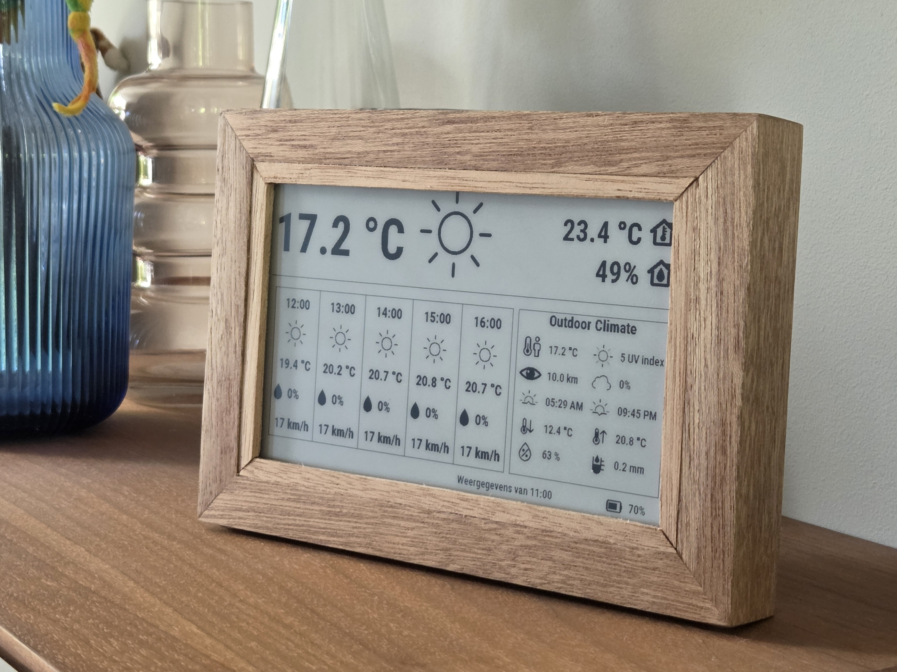

# StratusDash - 04-2025 t/m heden

StratusDash is een batterijgevoed e-paper dashboard voor in huis. Het meet temperatuur, luchtvochtigheid en luchtdruk, combineert die met weersinformatie en toont alles op een rustig display dat echt maanden zonder kabel werkt. Wat begon als een schoolprototype, draait inmiddels op acht actieve apparaten waarvoor ik de firmware, backend en webapp beheer.

## Context

Het idee begon thuis met een klein weerstation dat steeds batterijen leeg trok en waarvan de buitenmodule onbetrouwbaar was. Tijdens een schoolproject kreeg ik de kans om de basis van een beter alternatief te bouwen. Na die eerste tien weken ben ik er zelfstandig mee doorgegaan: firmware, backend, frontend, hardwarekeuzes, behuizing, assemblage en deployment.

Het doel was niet alleen een werkend prototype. Het was een product dat mensen echt in hun huis kunnen plaatsen zonder er dagelijks aan te hoeven denken.

## Mijn rol

Ik ontwerp, bouw en beheer StratusDash zelf. Mijn werk loopt van de firmware en hardware tot de webapp, het releaseproces en de voorbereiding op productie:

- Firmware en beheer: ESP32-firmware, energieoptimalisatie, e-paper rendering, OTA-updates en telemetry.
- Webapp en backend: de FastAPI-backend, Astro-PWA en alles rond accounts, apparaten en layouts.
- Hardware en fabricage: componentkeuze, prototyping, behuizingen, assemblage en de voorbereiding van een eigen PCB.
- Productontwikkeling: privacy, licenties, certificering, productieplan en kostprijs.

## Het probleem

De grootste technische uitdaging was een lange batterijduur halen zonder betrouwbaarheid in te leveren. Wifi, TLS en het bijwerken van het display gebruiken veel meer energie dan deep sleep. Daardoor kunnen enkele seconden vertraging, zeker bij een slechte verbinding, op termijn veel stroom kosten.

## Wat ik bouwde

De huidige units gebruiken een FireBeetle 2 ESP32-E, een 7,5-inch zwart-wit e-paper display, een BME280-sensor en een 2500 mAh LiPo. Het apparaat meet het binnenklimaat en toont dit samen met de weersverwachting en andere informatie op een configureerbare layout.

De FastAPI-backend beheert accounts, apparaten, layouts, metingen en firmware-releases. Voor Nederlandse locaties gebruikt hij het KNMI HARMONIE-model voor weersverwachtingen en KNMI-stations voor de actuele temperatuur. Buiten het bereik van dat model valt het systeem terug op WeatherAPI.

Via de Astro-webapp kunnen gebruikers hun apparaten koppelen en configureren, metingen en historie bekijken en toegang delen met anderen. De webapp is ook installeerbaar als PWA en heeft aparte Nederlandse en Engelse versies:

- [stratusdash.nl](https://stratusdash.nl)
- [stratusdash.com](https://stratusdash.com)

Voor het maken van layouts bouwde ik [Layout Studio](https://builder.stratusdash.com). De editor werkt rechtstreeks met hetzelfde 800 bij 480-formaat dat de firmware gebruikt en leest de lettertypen, iconen en standaardlayouts uit dezelfde repository. Layouts worden nu nog lokaal in de browser opgeslagen en zijn niet aan een account gekoppeld.

De Home Assistant-integratie haalt elke vijftien minuten de metingen van eigen apparaten op via een accounttoken en maakt daar sensoren voor temperatuur, luchtvochtigheid, luchtdruk en accuspanning van. Gegevens uit Home Assistant op het display tonen is nog niet af.

## Belangrijke technische keuzes

### Batterijduur

Bij low-power hardware is deep sleep alleen zuinig als alle pinnen zich gedragen. De pinnen van de e-paper-interface bleven tijdens deep sleep floaten, waardoor het apparaat ongemerkt stroom bleef gebruiken. Door ze expliciet aan te sturen en vast te houden, bracht ik het verbruik terug van een fluctuerend bereik van 35 tot 250 µA naar een stabiele deep-sleepmeting van ongeveer 11,7 µA.

De meeste energie wordt nu tijdens een wake gebruikt. De vroegste bewaarde productiefirmware deed daar gemiddeld 16,8 seconden over. Firmware `1.2.69` bracht dat terug naar 1,75 seconden, gemeten over 8.210 gezonde wakes. Op het monitoringdashboard houd ik zelfs een leaderboard bij. Een 1.2.50-run zonder schermupdate duurde slechts 396 ms, het huidige record!

Die winst komt onder andere door het onthouden van wifi-informatie, TLS session resumption en het overslaan van onnodige display-updates. De firmware hervat alleen sessies die uit een volledig geverifieerde TLS-verbinding komen. De sessie is aan de hostname en CA-identiteit gebonden en verloopt na zes uur. Daarna bouwt een volledige handshake een nieuwe sessie op.

Tijdens een ononderbroken test van zeven dagen verbruikte `1.2.69` gemiddeld 171,7 µA, oftewel 4,12 mAh per dag. Dat ondersteunt de omschrijving "ontworpen voor maximaal een jaar tussen laadbeurten", maar het is nog geen volledige ontlaadtest van een productieaccu. Het nadeel van een batterijduur van een jaar is dat het bewijzen ervan ook irritant lang duurt.

### Eigen e-paper driver

Ik verving de bestaande displaybibliotheek door een driver voor het specifieke `GDEY075T7`-paneel. Daarmee verdween een commercieel licentieprobleem en kon ik het net iets sneller maken.

### Device pairing

Het apparaat koppelt via een QR-code aan een gebruikersaccount. De firmware genereert een pairing attempt en een private device secret. De gebruiker scant de QR-code en claimt het apparaat via de webapp, terwijl het apparaat de claimstatus ophaalt bij de backend. De uiteindelijke API-token wordt alleen naar het fysieke apparaat teruggestuurd als het de private secret kent.

Deze flow voorkomt dat iemand met alleen de publieke QR-link de device-token kan stelen. Over het koppelproces is [hier](stratusdash-pairing.md) meer over te lezen.

### Firmware-releases

Firmware-updates gaan stapsgewijs door `dev`, `acc` en `stable`. Daarbij wordt hetzelfde firmwarebestand tussen de kanalen gepromoveerd zonder het opnieuw te bouwen. Na installatie markeert het apparaat de nieuwe binary pas als geldig wanneer het een volledige wake heeft doorlopen en klaar is om terug te gaan naar deep sleep. Gaat dat ergens mis, dan keert het automatisch terug naar de vorige binary en markeert het de mislukte release als onbruikbaar. Ook als die versie daarna nog wordt aangeboden, downloadt het apparaat het niet opnieuw. Elke release blijft herleidbaar tot de commit en bestandshash. Ondertekende firmware en het bijbehorende sleutelbeheer zijn nog niet af.

### Behuizing

De behuizing is gemaakt van merantihout dat ik zelf heb gezaagd, gefreesd, geschuurd, gebeitst, gelakt en gelijmd. Binnenin houdt een 3D-geprint frame de hardware op zijn plaats, met ruimte voor ventilatie en reparaties. Het kostte veel tijd om zeven behuizingen met de hand te maken, maar ik ben nog steeds trots op het resultaat.

### Telemetry

Zodra de apparaten bij gebruikers stonden, kon ik er niet meer even een debugger aan hangen. Daarom rapporteert elke wake onder andere de verbindingsduur, signaalsterkte, actieve tijd, resetoorzaak en HTTP-status aan het monitoringdashboard.

Tijdens een vaste audit voltooide firmware `1.2.69` 5.256 gewone wakes op acht actieve apparaten. Geen wake eindigde in een API- of DNS-fout. Drieënvijftig wakes hadden een tweede HTTP-poging nodig en herstelden allemaal. Toch liet een latere uitschieter zien waarom alleen gemiddelden niet genoeg zijn.

Op 17 augustus duurde één wake 133 seconden. De backend leek de voor de hand liggende verdachte, maar nginx en FastAPI verwerkten het verzoek binnen 213 ms. Uit de fasetelemetrie bleek dat de ESP32 daarvoor al 126,7 seconden was kwijtgeraakt aan een TLS-poging via het laatst bekende IP-adres.

De fout zat in de timeout. Het tijdsbudget voor de gecachte route gold alleen voor de TCP-verbinding. Zodra die verbinding stond, konden de TLS-handshake en een eventuele reconnect alsnog de veel langere standaardtimeout gebruiken. Ik verving dit door één doorlopende deadline voor de volledige verbindingspoging. Als die verloopt, gooit de firmware de gecachte route weg, voert hij opnieuw DNS uit en maakt hij een nieuwe, volledig geverifieerde verbinding.

In `1.2.69` duurde de slechtste gecachte verbindingspoging 126,7 seconden. In `1.2.72` was het maximum 2,3 seconden over de eerste 631 voltooide wakes. Die versie is via dezelfde releasekanalen op alle acht apparaten uitgerold en de twee minuten lange uitschieter is sindsdien niet teruggekomen.

## Resultaat

Ik bouwde en verkocht zeven vroege StratusDash-units voor ongeveer €150 per stuk. Samen met mijn testapparaat zijn er nu acht apparaten actief. StratusDash groeide daarmee van een schoolprototype naar een product dat ik dagelijks ontwikkel, uitrol en beheer.

StratusDash laat voor mij zien dat ik een embedded product van begin tot eind kan bouwen en beheren. De mooiste reactie kwam van een gebruiker die het apparaat een kunstwerk noemde. Dat bleef hangen, want ik wilde techniek maken die goed werkt, prettig in gebruik is en ook gewoon in een woonkamer past.

## Wat ik leerde

StratusDash leerde mij hoe snel een kleine productkeuze doorwerkt in de rest van het systeem. Meerdere layouts vragen om veranderingen in de firmware, backend en webapp. Een houten behuizing ziet er eenvoudig uit, maar kost per apparaat uren handwerk. Ik heb voor veel van die keuzes een goede oplossing gevonden, maar ze bepalen nog steeds hoeveel onderhoud en productiewerk het product vraagt.

Ik leerde ook dat low-power optimalisatie zonder metingen vooral raden is. Met mijn Coulomb Counter kon ik zien waar de energie werkelijk verdween en veranderingen over een volledige wake vergelijken. Toen de apparaten eenmaal bij gebruikers stonden, werd telemetry net zo belangrijk als een debugger.

## Volgende stap

De volgende stap is een serie van tien productie-achtige-units met een eigen PCB en een herhaalbaar proces voor de behuizing. Deze moeten door mensen buiten mijn directe omgeving gekocht en gebruikt kunnen worden zonder dat ik erbij hoef te helpen. Maar ik moet dus eerst een PCB maken, spannend.

Daarvoor werk ik nog aan:

- een eigen PCB en een reproduceerbare behuizing;
- ondertekende firmware en het bijbehorende sleutelbeheer;
- het CE- en RED-traject;
- kostprijs en vraag rond een verkoopprijs van €299 tot €329.

## Technische onderbouwing

- [Pairing-architectuur](stratusdash-pairing.md) - technische uitleg van het koppelproces.
- [Coulomb Counter](../coulombcounter/alflex-coulomb-counter.md) - het meetinstrument voor stroomverbruik.

## Gebruikte technologieën

`PlatformIO` `Arduino` `ESP32` `E-Paper` `BME280` `FastAPI` `SQLAlchemy` `MariaDB` `Astro` `PWA` `Home Assistant` `KNMI HARMONIE` `Linux VPS` `Cloudflare` `nginx`
